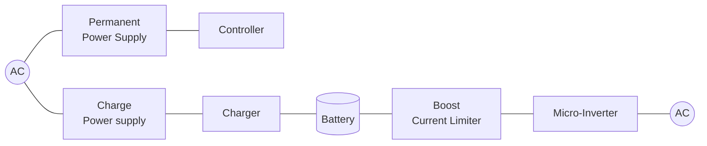
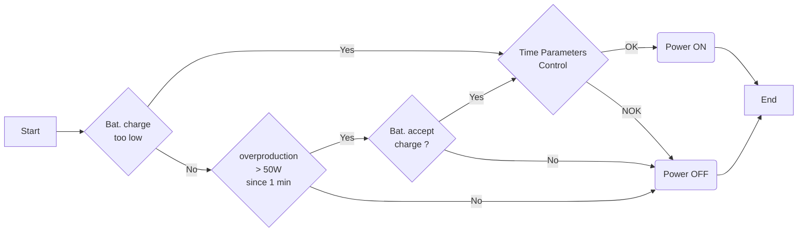
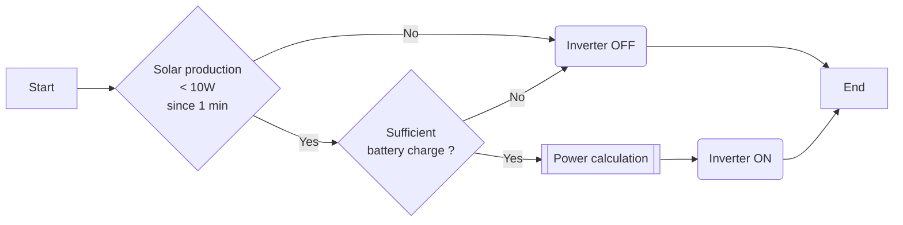
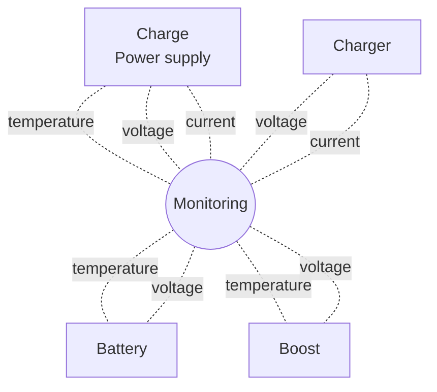

# Solar Energy Storage

:star: Star us on GitHub — it helps!

Stores the excess solar energy produced during the day to release it at night.  
This project was done on an Enphase self-consumption solar production facility. 
:warning: __It has many electrical hazards. It is best to use an approved energy storage system sold by your solar production system manufacturer.__ 
This project was done just for the fun of doing it yourself
## Specifications

### System flowchart

### Main features
- (main_001) Retrieves continuous production and overproduction informations. (measurement or reading)
- (main_002) Charge one or more batteries with the excess power production.
- (main_003) Releases energy stored on the home grid when solar production is inactive.
- (main_004) Maintain batteries in good condition to preserve their lifespan.
- (main_005) Do not release more stored energy than necessary for home consumption

### Power management
- (power_001) Retrieving data from Envoy gateway every second

Production and overproduction can be measured with AC current measurement clamps. 
However for this project, the installation already includes an Enphase Envoy-s Metered gateway. Thus, the energy information can be read on the Ethernet connection. 
The Envoy gateway can return a JSON containing lots of information. Simply interrogate in http the gateway on its IP address (example: http://xxx.xxx.xxx.xxx/production.json)

- (power_002) Power start based on overproduction information, battery status and time.

- (power_003) Adjustment of the power delivered to the micro-inverter according to grid consumption and the battery state

- (power_004) Power supply status monitoring

- (power_005) Activation/Deactivation of elements for safety and energy saving

The following items can be disabled and disconnected: 
Charge power supply 
Charger 
Boost Current Limiter

### Battery management
- (battery_001) Adapts the charging current according to the available overproduction power.
- (battery_002) Use of charging cycles according to the type of batteries. (Lead-acid, AGM, Li-ION ...)
- (battery_003) Battery Charge and Cycle Rate Calculation
- (battery_004) Discharge Rate Limiting and Deep Discharge Protection

## Hardware

To avoid overconsumed goods, a large part of the Hardware elements were chosen with what I had available. Some choices could be more judicious in performance. However I try to use and reuse as many things as possible without having to buy new.

### Power supply

ATX power supply 550W + Boost module 400W

### Boost Current Limiter / Micro Inverter

Enphase IQ7+

### Controller

Arduino MEGA

## License

MIT License